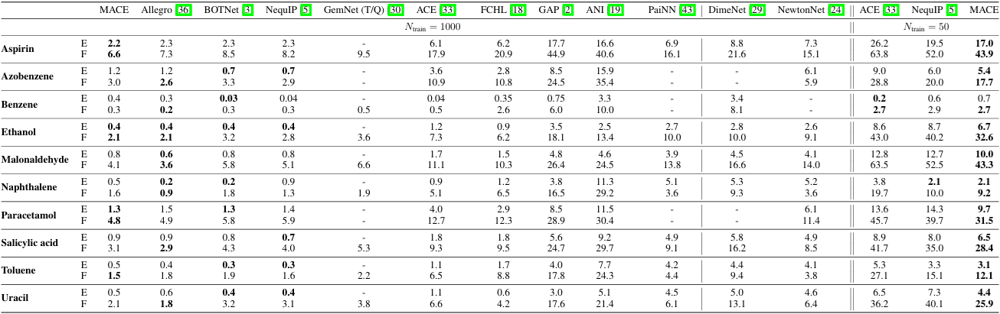

# MACE rMD17 Benchmark Reproduction

Reproduction of the rMD17 molecular dynamics benchmark from the MACE paper.

## Overview

This repository contains code to reproduce the rMD17 benchmark results from:

> Batatia et al., "MACE: Higher Order Equivariant Message Passing Neural Networks for Fast and Accurate Force Fields", NeurIPS 2022

The revised MD17 (rMD17) dataset contains 10 molecules with energies and forces recalculated at the PBE/def2-SVP level of theory.

## Our Results vs Paper

All 10 molecules trained with 256 channels, L=3 equivariant features 

| Molecule | Atoms | Our E MAE (meV) | Paper E | Our F MAE (meV/Å) | Paper F | Ratio |
|----------|------:|----------------:|--------:|------------------:|--------:|------:|
| aspirin | 21 | 2.4 | 2.2 | 8.9 | 6.6 | 1.4x |
| azobenzene | 24 | 0.8 | 1.2 | 3.4 | 2.6 | 1.3x |
| benzene | 12 | 0.1 | 0.4 | 0.7 | 0.3 | 2.2x |
| ethanol | 9 | 0.4 | 0.4 | 2.7 | 2.1 | 1.3x |
| malonaldehyde | 9 | 0.8 | 0.8 | 6.0 | 5.0 | 1.2x |
| naphthalene | 18 | 0.3 | 0.5 | 1.9 | 1.3 | 1.5x |
| paracetamol | 20 | 2.2 | 1.5 | 5.5 | 4.1 | 1.3x |
| salicylic | 16 | 1.1 | 0.9 | 5.0 | 3.8 | 1.3x |
| toluene | 15 | 0.4 | 0.5 | 2.2 | 1.5 | 1.5x |
| uracil | 12 | 0.6 | 0.5 | 3.6 | 2.8 | 1.3x |


> See [summary/results_summary.md](summary/results_summary.md) for detailed results including RMSE and training curves.



## Installation

```bash
# 1. Create conda environment (recommended)
conda create -n mace python=3.11
conda activate mace

# 2. Install PyTorch with CUDA (adjust for your CUDA version)
pip install torch --index-url https://download.pytorch.org/whl/cu118

# 3. Install MACE
pip install mace-torch

# 4. Install other dependencies
pip install numpy matplotlib
```

## Data Download

Download the rMD17 dataset from [Figshare](https://figshare.com/articles/dataset/Revised_MD17_dataset_rMD17_/12672038):

```bash
cd data/
wget https://figshare.com/ndownloader/files/23950376 -O rmd17.tar.bz2
tar -xjf rmd17.tar.bz2
```

Expected structure after extraction:
```
data/rmd17/
├── npz_data/          # 10 molecule .npz files (~100K conformations each)
│   ├── rmd17_aspirin.npz
│   ├── rmd17_ethanol.npz
│   └── ...
├── splits/            # Pre-defined train/test splits (5 sets)
│   ├── index_train_01.csv
│   ├── index_test_01.csv
│   └── ...
└── readme.txt
```

## Usage

### Quick Start: Train a Single Molecule

```bash
python MACE_rMD17.py --molecule ethanol --device cuda --channels 256
```

This will:
1. Load data from `data/rmd17/npz_data/rmd17_ethanol.npz`
2. Convert NPZ → Extended XYZ format (with unit conversion kcal/mol → eV)
3. Train MACE for 1000 epochs (Stage One: 1-799, Stage Two/SWA: 800-1000)
4. Save model and logs to `results/ethanol/run_ch256_<timestamp>/`

### Train All 10 Molecules

```bash
python MACE_rMD17.py --device cuda --channels 256
```

### Other Options

```bash
# Prepare XYZ datasets without training
python MACE_rMD17.py --prepare-only

# Use different train/test split (1-5 available)
python MACE_rMD17.py --molecule ethanol --split 2

# Generate shell scripts for manual execution
python MACE_rMD17.py --generate-scripts

# Use 128 channels (faster but less accurate)
python MACE_rMD17.py --molecule ethanol --channels 128
```

### Collect Results to summary/

After training, collect all results into a lightweight folder for sharing:

```bash
python collect_results.py
```

This creates `summary/` (~4 MB) with:
- `results_summary.md` — Final MAE/RMSE tables
- `logs/` — Human-readable training logs
- `plots/` — Training curve visualizations

### Plot Training Curves

```bash
python plot_all_training.py
```

## Model Configuration

Following MACE paper Appendix A.5.1:

| Parameter | Value |
|-----------|-------|
| hidden_irreps | 256x0e + 256x1o + 256x2e + 256x3o |
| num_interactions | 2 |
| correlation | 3 (body order 4) |
| max_ell | 3 |
| r_max | 5.0 Å |
| radial_MLP | [64, 64, 64] |
| batch_size | 5 |
| max_num_epochs | 1000 |
| lr | 0.01 |
| energy_weight | 1.0 (Stage Two: 1000.0) |
| forces_weight | 1000.0 |
| optimizer | AMSGrad Adam |
| scheduler | ReduceLROnPlateau (patience=50, factor=0.8) |
| EMA decay | 0.99 |
| Stage Two start | epoch 800 |
| default_dtype | float32 |

## Project Structure

```
mace-rmd17-benchmark/
├── MACE_rMD17.py          # Main training script
├── collect_results.py      # Collect results to summary/
├── plot_all_training.py    # Batch plotting for all molecules
├── data/                   # rMD17 dataset (download separately)
│   └── rmd17/
├── results/                # Training outputs (gitignored, ~4 GB)
│   └── <molecule>/
│       ├── train.xyz / test.xyz
│       └── run_ch256_<timestamp>/
├── logs/                   # MACE training logs (gitignored)
├── summary/                # Lightweight results for sharing (~4 MB)
│   ├── results_summary.md
│   ├── logs/
│   └── plots/
├── EXPERIMENT_LOG.md       # Experiment history and exploration notes
└── README.md
```

## Experiment Log

See [EXPERIMENT_LOG.md](EXPERIMENT_LOG.md) for the full experiment history, including:
- Run 1-4: Ethanol experiments exploring L=0 → L=3, 128 → 256 channels
- Run 5: All 10 molecules with final configuration

## References

- [MACE Paper (arXiv)](https://arxiv.org/abs/2206.07697)
- [rMD17 Dataset (Figshare)](https://figshare.com/articles/dataset/Revised_MD17_dataset_rMD17_/12672038)
- [MACE GitHub](https://github.com/ACEsuit/mace)
- [ASE Documentation](https://wiki.fysik.dtu.dk/ase/)

## License

MIT
