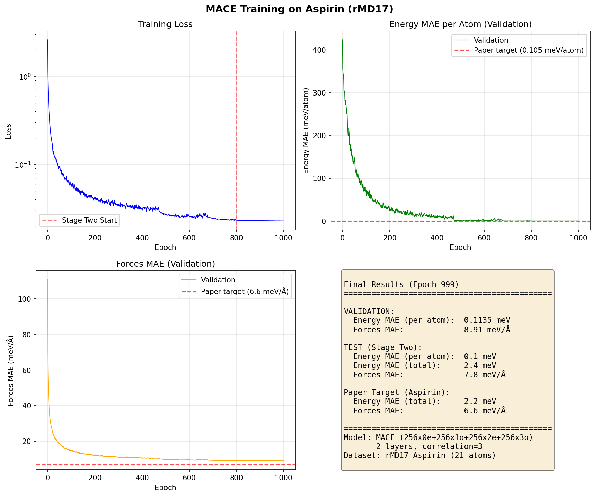
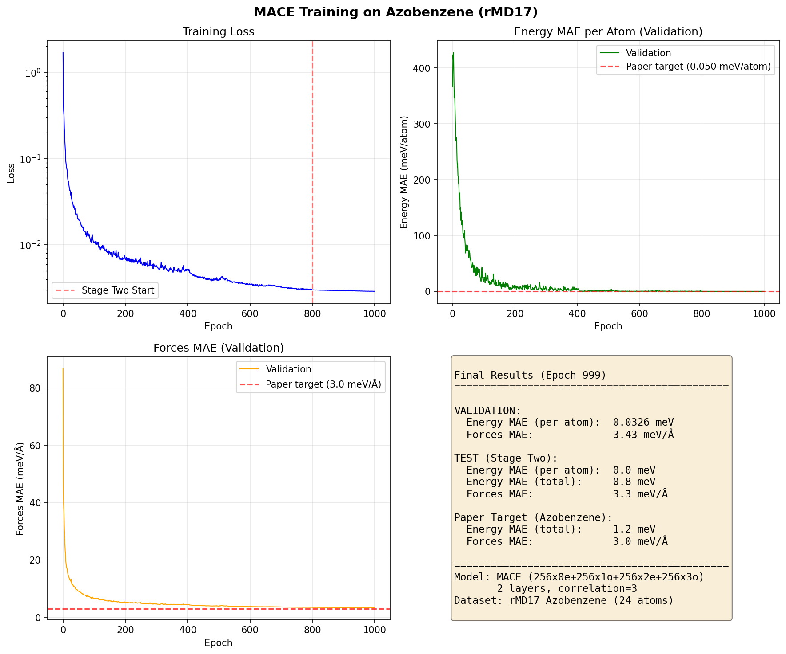
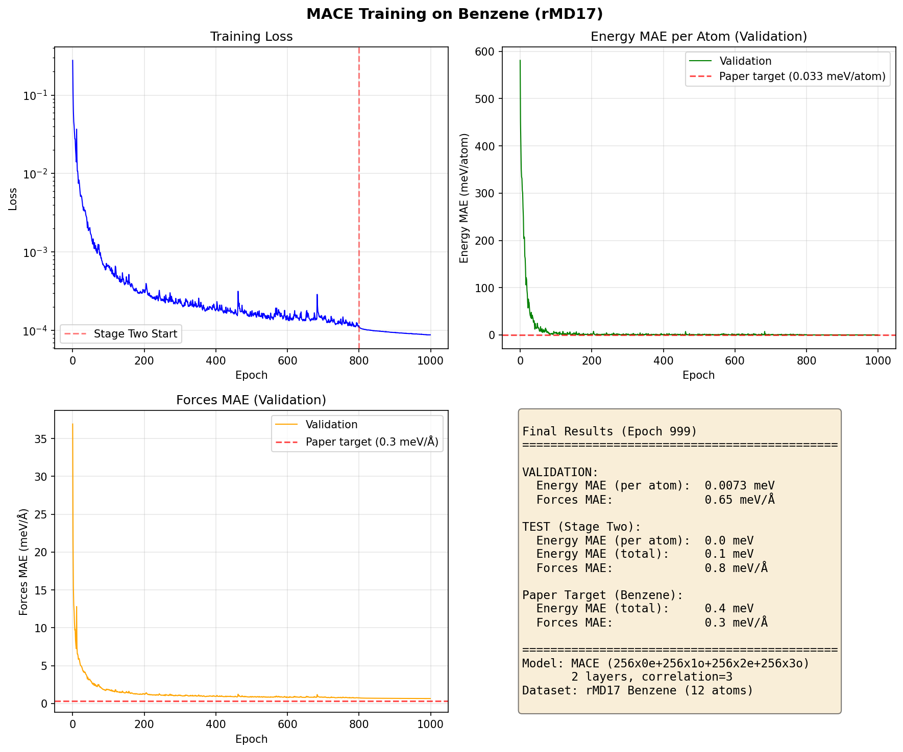
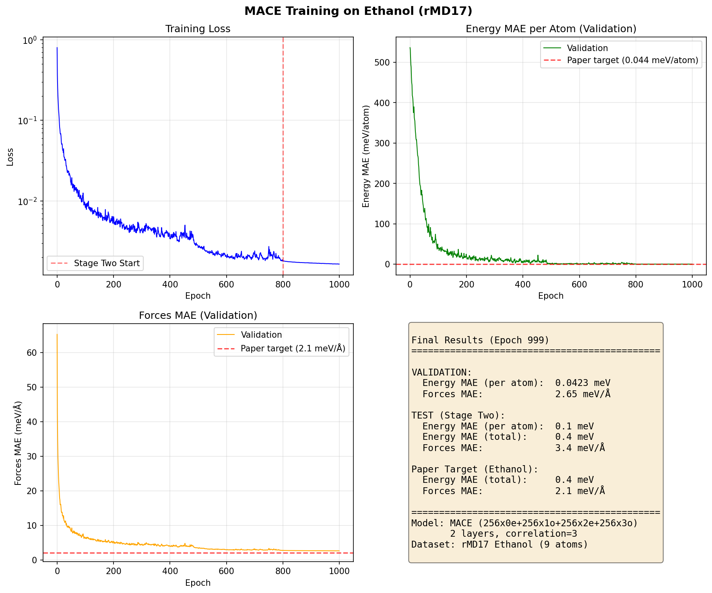
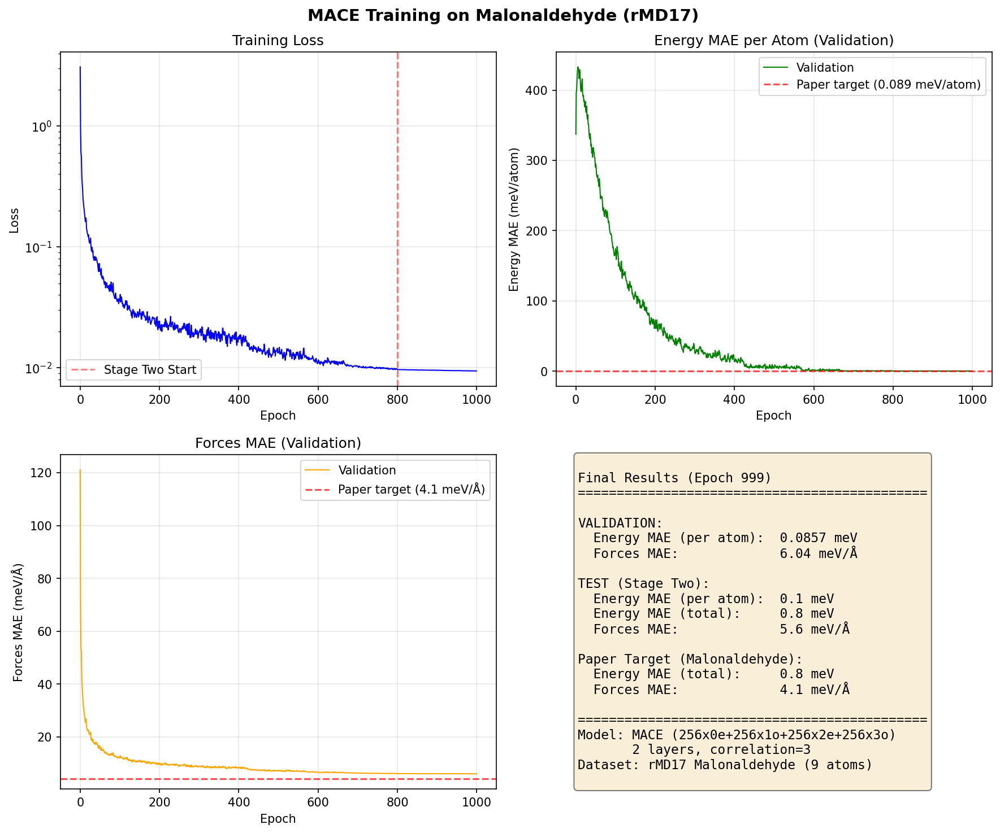
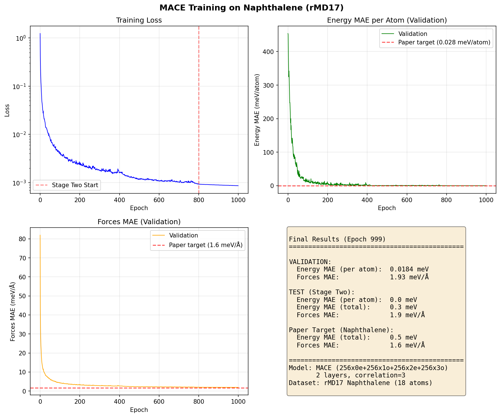
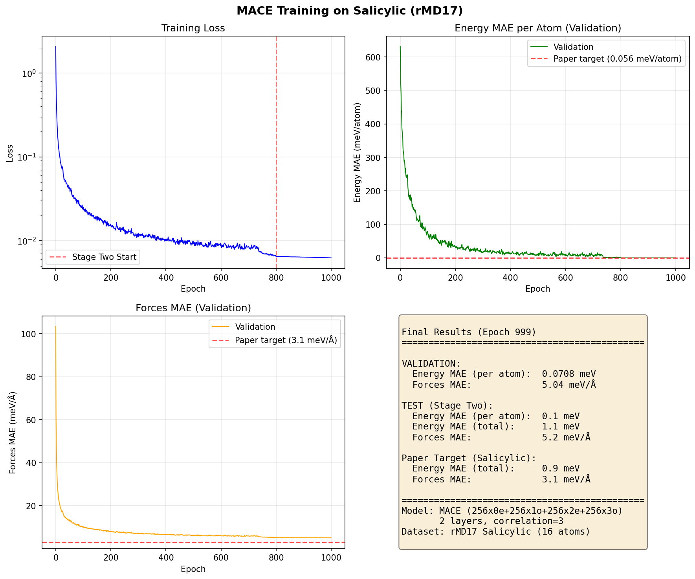
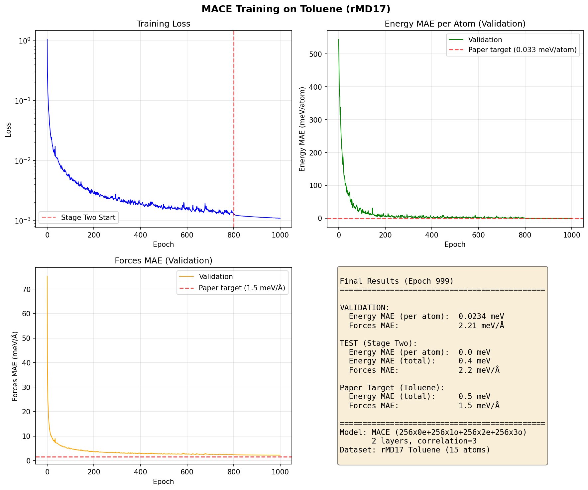
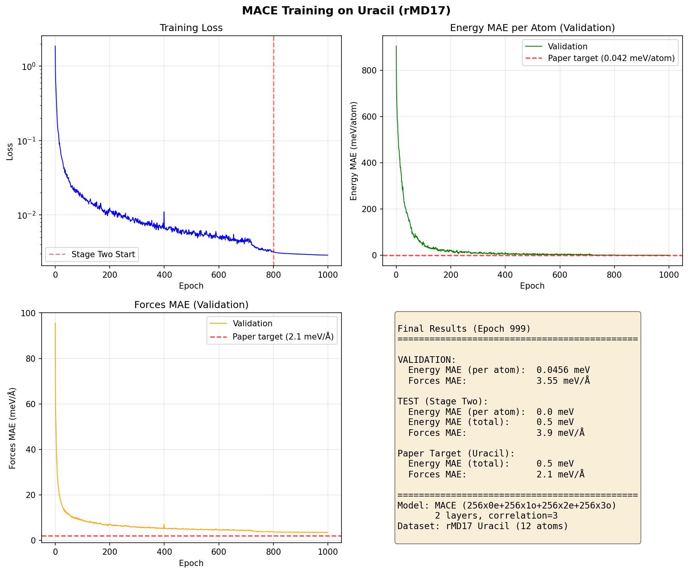

# MACE rMD17 Benchmark Results

**Model:** MACE (256x0e+256x1o+256x2e+256x3o, L=3, 256 channels)
**Settings:** 2 layers, correlation=3, r_max=5.0 Å, batch_size=5, 1000 epochs
**Split:** index 1 (1000 train → 950 train + 50 valid, 1000 test)
**Date:** 2026-02-26 ~ 2026-02-27

## Results Table

| Molecule | Atoms | Energy MAE (meV) | Paper E (meV) | Forces MAE (meV/Å) | Paper F (meV/Å) | F Ratio |
|----------|------:|-----------------:|--------------:|-------------------:|----------------:|--------:|
| aspirin | 21 | 2.4 | 2.2 | 8.9 | 6.6 | 1.4x |
| azobenzene | 24 | 0.8 | 1.2 | 3.4 | 2.6 | 1.3x |
| benzene | 12 | 0.1 | 0.4 | 0.7 | 0.3 | 2.2x |
| ethanol | 9 | 0.4 | 0.4 | 2.7 | 2.1 | 1.3x |
| malonaldehyde | 9 | 0.8 | 0.8 | 6.0 | 5.0 | 1.2x |
| naphthalene | 18 | 0.3 | 0.5 | 1.9 | 1.3 | 1.5x |
| paracetamol | 20 | 2.2 | 1.5 | 5.5 | 4.1 | 1.3x |
| salicylic | 16 | 1.1 | 0.9 | 5.0 | 3.8 | 1.3x |
| toluene | 15 | 0.4 | 0.5 | 2.2 | 1.5 | 1.5x |
| uracil | 12 | 0.6 | 0.5 | 3.6 | 2.8 | 1.3x |

## RMSE Table

| Molecule | Energy RMSE (meV) | Forces RMSE (meV/Å) |
|----------|------------------:|--------------------:|
| aspirin | 3.4 | 15.1 |
| azobenzene | 1.1 | 5.4 |
| benzene | 0.2 | 0.9 |
| ethanol | 0.6 | 4.1 |
| malonaldehyde | 1.1 | 9.7 |
| naphthalene | 0.6 | 2.9 |
| paracetamol | 2.8 | 8.2 |
| salicylic | 1.7 | 7.9 |
| toluene | 0.5 | 3.3 |
| uracil | 0.8 | 5.4 |

## Training Curves

### Aspirin

### Azobenzene

### Benzene

### Ethanol

### Malonaldehyde

### Naphthalene

### Paracetamol

### Salicylic

### Toluene

### Uracil

## Hyperparameters (following MACE paper Appendix A.5.1)

| Parameter | Value |
|-----------|-------|
| hidden_irreps | 256x0e+256x1o+256x2e+256x3o |
| num_interactions | 2 |
| correlation | 3 |
| max_ell | 3 |
| r_max | 5.0 Å |
| radial_MLP | [64, 64, 64] |
| num_radial_basis | 8 |
| num_cutoff_basis | 5 |
| batch_size | 5 |
| max_num_epochs | 1000 |
| lr | 0.01 |
| scheduler | ReduceLROnPlateau (patience=50, factor=0.8) |
| optimizer | AMSGrad Adam (β₁=0.9, β₂=0.999, ε=1e-8) |
| weight_decay | 5e-7 |
| energy_weight | 1.0 (Stage Two: 1000.0) |
| forces_weight | 1000.0 (Stage Two: 1000.0) |
| EMA decay | 0.99 |
| Stage Two start | epoch 800 |
| activation | SiLU |
| readout MLP | 16x0e |
| default_dtype | float32 |
| seed | 42 |
